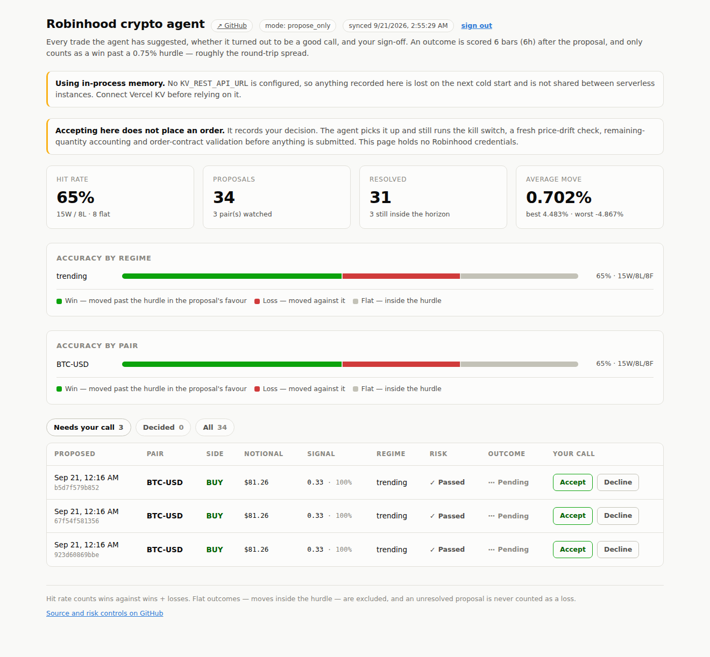

# Dashboard

A web view of every trade the agent has suggested, whether those suggestions
turned out to be good, and a place to accept or decline the ones waiting on you.



## What it does and does not do

**It does not place orders, and it holds no Robinhood credentials.**

Accepting a proposal here *records your decision*. The agent picks that decision
up on its next `rhca dashboard-sync` and still runs it through the full approval
gate before anything is submitted: the kill switch, a fresh price-drift check
against the live quote, remaining-quantity accounting across tranches, and
order-contract validation. A web button is an input to that gate, never a
bypass of it.

Two consequences worth stating plainly:

- **A risk-blocked proposal has no Accept button.** Overriding the risk engine
  stays a deliberate, typed act in the terminal. The phrase that does it is
  redacted from anything you type here, *and* the agent refuses an override
  that did not come from a typed instruction — two independent guards.
- **The data pushed here is deliberately thin.** No account numbers, no buying
  power, no portfolio value, no order ids. The dashboard needs to know what was
  suggested and how it turned out; it does not need to know how much money sits
  behind it.

## Deploying to Vercel

```bash
# 1. From the repository root
cd dashboard
npx vercel            # link the project, first deploy
```

Then set these in **Project → Settings → Environment Variables**:

| Variable | Required | What it is |
|---|---|---|
| `RHCA_DASHBOARD_TOKEN` | yes | Shared secret for `rhca dashboard-sync`. `openssl rand -hex 32` |
| `DASHBOARD_PASSWORD` | to decide | Password for accepting/declining. **Unset ⇒ read-only** |
| `NEXT_PUBLIC_REPO_URL` | no | Repo link in the header |
| `KV_REST_API_URL` / `KV_REST_API_TOKEN` | in production | Set automatically by the Vercel KV integration |

Add **Storage → KV** from the Vercel dashboard before relying on it. Without
it the app falls back to in-process memory, which does not survive a cold start
and is not shared between serverless instances — the page says so in a banner
rather than pretending otherwise.

Consider also turning on **Deployment Protection** so the whole deployment sits
behind Vercel auth. It composes with the password.

Then, where the agent runs:

```bash
export RHCA_DASHBOARD_URL=https://your-project.vercel.app
export RHCA_DASHBOARD_TOKEN=<the same token>
rhca dashboard-sync
```

That one command pushes proposals and outcomes up, and pulls your decisions
back down. Run it on a schedule alongside your quote ingestion.

## Running locally

```bash
npm install
RHCA_DASHBOARD_TOKEN=dev-token DASHBOARD_PASSWORD=dev npm run dev
# then, from the repo root:
rhca dashboard-sync --url http://localhost:3000 --token dev-token
```

`http://localhost:...` is the one non-HTTPS URL the agent will send a token to.

## Reading the numbers

- **Hit rate** is wins as a share of wins + losses. Flat outcomes — moves that
  stayed inside the hurdle — are excluded, and a proposal still inside its
  horizon is never counted as a loss. With nothing resolved the rate shows as
  `—`, meaning *unknown*, not zero.
- An outcome is scored a fixed number of bars after the proposal, and only
  counts as a win past a hurdle set above a typical round-trip spread. A gain
  smaller than the spread is not a win in practice, so it is not one here.
- Outcomes are scored for **every** proposal, including ones you declined. The
  record is of the agent's judgement, not of the subset you happened to like.

## Routes

| Route | Auth | Purpose |
|---|---|---|
| `/` | session cookie | The dashboard |
| `POST /api/proposals` | bearer token | Ingest from `rhca dashboard-sync` |
| `GET /api/proposals` | bearer token | Read back the stored payload |
| `GET /api/decisions` | bearer token | Decisions for the agent to pull |

Decisions are **written** only by a server action behind the session cookie —
there is no HTTP route that accepts a decision, so there is nowhere to POST a
forged one.
